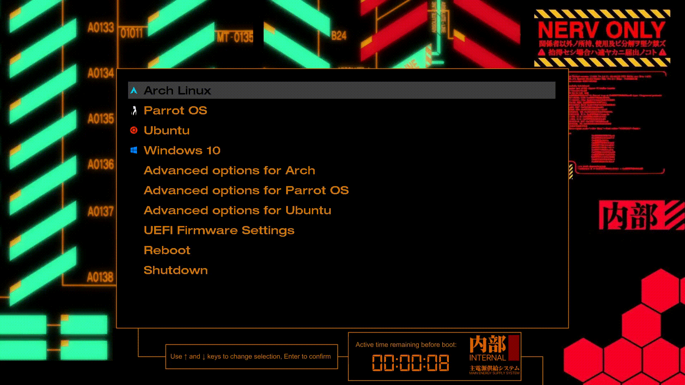

# Evangelion inspired GRUB theme



### how to install

```
git clone https://github.com/Tihmz/evangelion-grub-theme.git
sudo cp -r evangelion-grub-theme /boot/grub/themes/
```

Then edit the file `/etc/default/grub` and change the following line :
```
[...]
GRUB_THEME=/boot/grub/themes/evangelion-grub-theme/theme.txt
[...]
```

Finally, update your grub configuration with `sudo update-grub`

### how to remove

Simply delete the folder and remove the line :
```
sudo rm -rf /boot/grub/themes/evangelion-grub-theme
sudo sed -i '/^GRUB_THEME/d' /etc/default/grub
sudo update-grub
```


